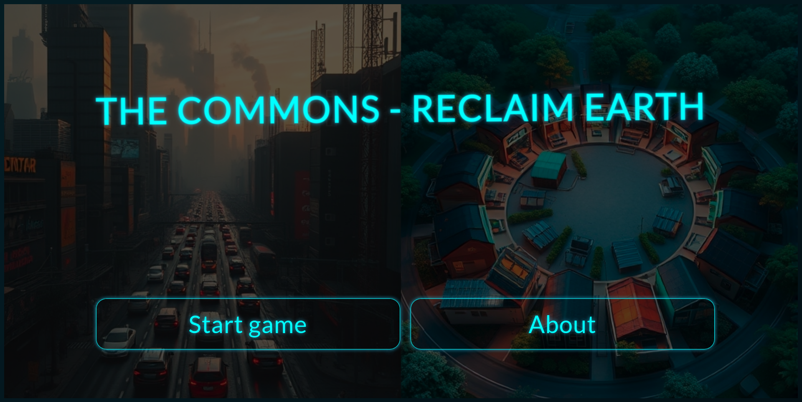

# The Commons - Reclaim Earth gamebook



## Replay life on Earth from scratch

Would you repeat the same mistakes civilization did?

Can you challenge your own beliefs?

Is the course of humanity inevitable?

Is there an alternative to capitalism, dictatorship and technocratic society?

## Community

https://www.reddit.com/r/Commons_ReclaimEarth

## Installation

The app runs on the public IPFS network. In order to use it follow the steps below:

1. Install the official IPFS Desktop http://docs.ipfs.io/install/ipfs-desktop/
2. Install IPFS Companion http://docs.ipfs.io/install/ipfs-companion/
3. Install golang 1.20 or later version - https://go.dev/doc/install
4.  Clone https://github.com/stateless-minds/kubo to your local machine
```
git clone https://github.com/stateless-minds/kubo.git
```
5. Build it and start the daemon:
``` 
cd kubo
make build
./cmd/ipfs/ipfs daemon --enable-pubsub-experiment
```
7.  Navigate to <a href="https://ipfs.io/ipns/k51qzi5uqu5dge9p6mb7nqaozuc9t3ns4q818hhwuqi7hqgct83lw6jzqaq2pw">The Commons - Reclaim Earth</a>
8.  If you like the app consider pinning it to your local node so that you become a permanent host of it while you have IPFS daemon running


## Acknowledgments

1. <a href="https://go-app.dev/">go-app</a>
2. <a href="https://ipfs.io/">IPFS</a>
3. <a href="https://github.com/ao6820/js-interactive-novel-template">js-interactive-novel-template</a>
4. All the rest of the authors who worked on the dependencies used! Thanks a lot!

## Contributing

<a href="https://github.com/stateless-minds/the-commons-reclaim-earth/issues">Open an issue</a>

## License

Stateless Minds (c) 2024 and contributors

MIT License